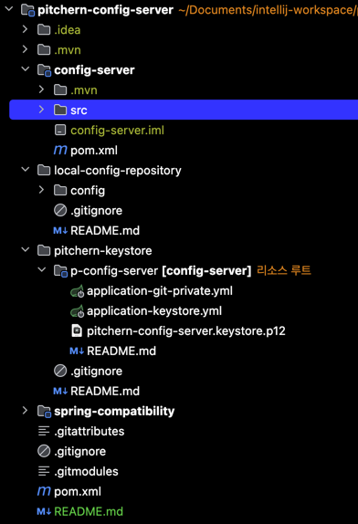
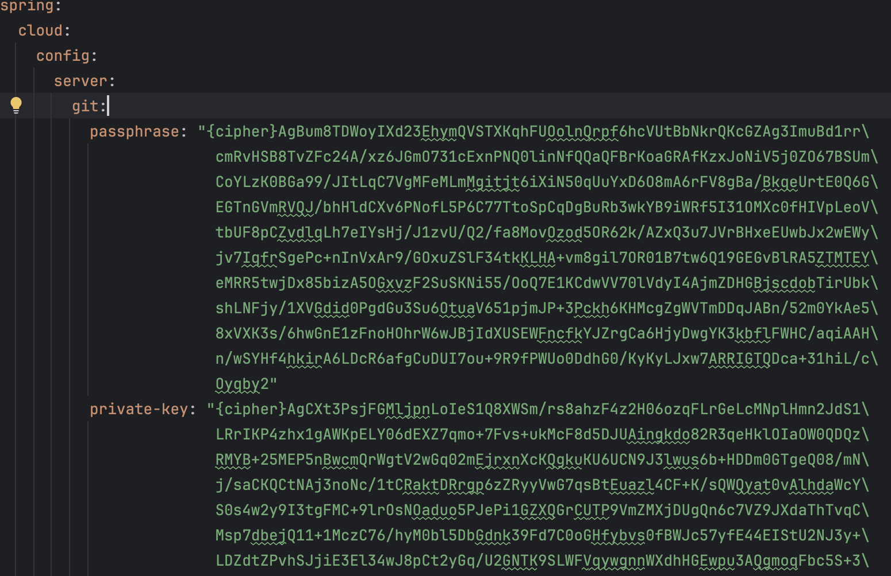

# pitchern-config-server

config server 를 git private repository 와 연계한 프로젝트

git submodule 로 보안을 위한 keystore project 를 가진다.

## 구조

**submodule** 을 포함 하므로 꼭 함께 받아야함.
```bash
# 최초
git clone --recursive https://github.com/username/repo.git
# submodule 없이 clone 한 이후 submodule 끌어오기
git submodule update --init --recursive
```

1. pitchern-config-server
   - 부모 프로젝트
2. pitchern-config-server/config-server
   - spring cloud config server 모듈
3. pitchern-config-server/pitchern-keystore
   - private git repository 에 대한 암호화 keystore 및 설정값을 가진 모듈
4. pitchern-config-server/spring-compatibility
   - spring oauth, spring session 등 자체 기능을 추가한 모듈
   - [git repo](https://github.com/pitcher0303/spring-compatibility)

## 암호화 관련
1. 시작은 설정 값을 git private repository 로 관리하는것을 목표로 시작했다.
2. git private repository 연결을 위해 ssh-private-key 가 config-server 소스에 존재해야 했다.
3. git ssh-private-key 를 public 으로 노출하는 것은 보안적으로 맞지 않으므로 암호화를 하자! 라고 생각함.
4. spring config server encrypt 엔드포인트로 ssh-private-key를 암호화 하기로 했다.
5. keystore 가 필요 했다.
6. keystore 또한 노출 되면 안된다.
7. keystore 를 private repository 로 올리고 git submodule 로 만들자!
8. 어?? 그럼 4번의 ssh-private-key 도 암호화 하지 않고 7번의 private repository 에 올리면 되네?
9. 4번 암호화 할 필요가 굳이 없으나 암호화를 해보긴 했다. application-git-private.yml 에 암호화한 키가 들어가 있다.
10. 끝

## config-server 로드시
1. application-local.yml 에서 `Git` 백엔드 임을 확인하고 `clone-on-start: true` 이므로 ssh clone 시작
2. 설정된 repository 가 private 이며 ssh 구성이므로 ssh-private-key 를 찾음.
3. `ignore-local-ssh-settings: true` 이므로 설정파일 내에서 private-key 를 찾음
4. private-key 가 아래 처럼 `{cipher}` 로 암호화 되어 있으므로 keystore 를 찾음
5. application-keystore.yml 에 명시된 keystore 를 찾고 `{cipher}` 값을 복호화함.
6. `복호화된 private-key, passphrase` 를 가지고 `git clone` 시작
7. 정상완료 후 server 시작 완료.

> 아래는 실제 구성 했을 때 화면



> application-git-private.yml 예시
> > 그대로 public 에 올려도 되지만 어쨋든 양방향은 뚫을 수 있으니까...



> pitchern-keystore 를 config-server 의 pom 설정에서 resource 루트로 설정했다.

```xml
<build>
    ...
    <resources>
        <resource>
            <directory>../pitchern-keystore/p-config-server</directory>
        </resource>
    </resources>
    ...
</build>
```
